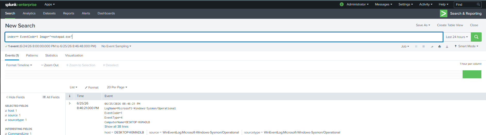
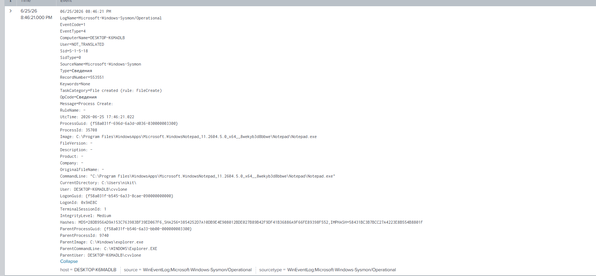
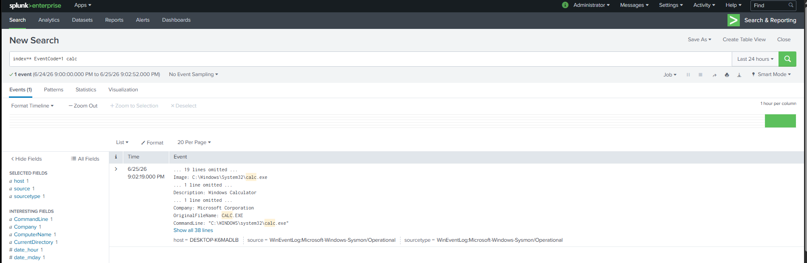
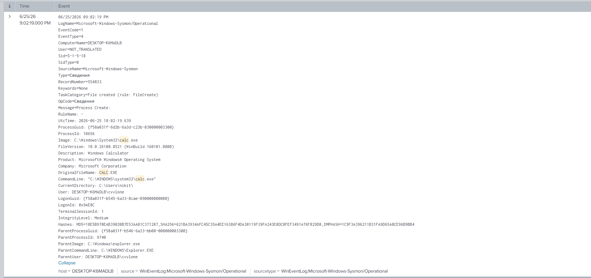
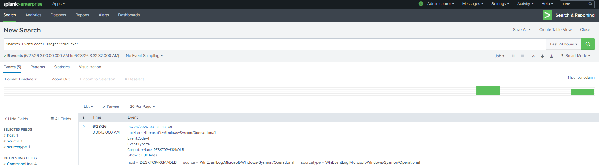
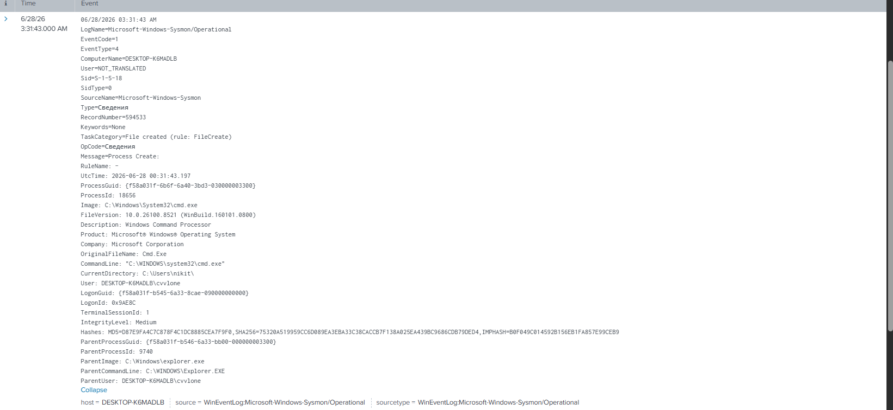
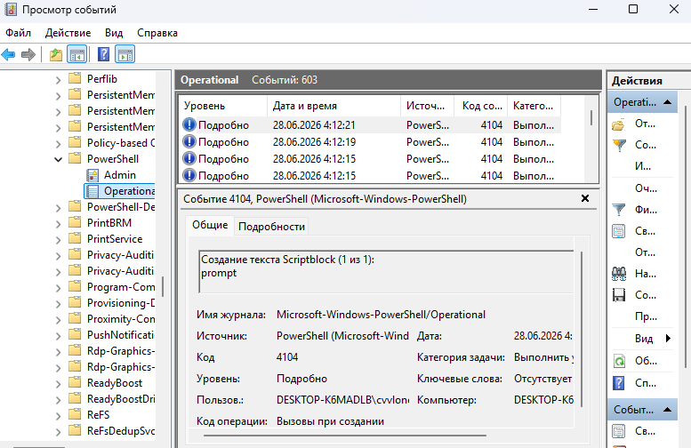

# Home SIEM Lab with Splunk and Sysmon

## Цель проекта

Развернуть домашнюю SIEM-лабораторию с использованием Splunk Enterprise и Sysmon для сбора, анализа и обнаружения подозрительной активности, генерируемой с виртуальной машины Kali Linux.

## Архитектура стенда

### Windows 11 Host
- Splunk Enterprise
- Sysmon

### Kali Linux VM
- Симуляция активности атакующего
- Сетевое сканирование

## Анализ событий создания процессов (Sysmon Event ID 1)

После настройки Splunk Enterprise и подключения журнала Sysmon следующим этапом стало изучение одного из самых важных событий Windows — **Sysmon Event ID 1 (Process Creation)**.

### Что такое Event ID 1

Событие **Event ID 1** регистрируется каждый раз, когда в операционной системе Windows запускается новый процесс. Практически любая программа, служба или вредоносное ПО перед выполнением своих действий сначала создает новый процесс, поэтому именно это событие является одним из основных источников информации для аналитика SOC.

При расследовании инцидентов Event ID 1 позволяет ответить на несколько ключевых вопросов:

* какой процесс был запущен;
* кто его запустил;
* когда он был запущен;
* каким процессом он был создан;
* с какими параметрами был выполнен запуск;
* где находится исполняемый файл.

Именно поэтому анализ событий Process Creation является одним из первых этапов практически любого расследования.

---

## Практическая часть

Для изучения структуры события были последовательно запущены несколько стандартных приложений Windows:

* Блокнот (Notepad);
* Калькулятор (Calculator);
* Командная строка (cmd.exe).

После запуска каждого приложения выполнялся поиск соответствующего события в Splunk.

Использование стандартных приложений позволяет сначала изучить нормальное (легитимное) поведение системы. В дальнейшем это помогает отличать обычную активность пользователя от потенциально вредоносных действий.

---

### Запуск Блокнота (Notepad)

Сначала был открыт стандартный текстовый редактор Windows — **Notepad**.

После этого в Splunk был выполнен поиск события Process Creation, соответствующего запуску данного процесса.

На рисунке ниже показан поиск события.

После открытия найденного события был выполнен анализ всех его полей.

В результате анализа было установлено:

* процесс был запущен пользователем **cvvlone**;
* родительским процессом являлся **explorer.exe**;
* уровень привилегий процесса — **Medium**;
* путь к исполняемому файлу соответствует стандартному расположению Windows.

Полученные данные свидетельствуют о нормальном запуске приложения пользователем.

---

### Запуск Калькулятора (Calculator)

Аналогичным образом был выполнен запуск стандартного приложения **Calculator**.

После запуска в Splunk было найдено соответствующее событие Event ID 1.

После открытия события были изучены все параметры процесса.

Структура события полностью соответствует запуску легитимного приложения Windows.

---

### Запуск командной строки (cmd.exe)

Следующим этапом был выполнен запуск командной строки Windows.

После открытия cmd.exe в Splunk было найдено соответствующее событие создания процесса.

После открытия события был выполнен его подробный анализ.

Несмотря на то, что **cmd.exe** является легитимным процессом Windows, именно через командную строку злоумышленники чаще всего выполняют:

* разведку системы;
* выполнение команд;
* загрузку вредоносных файлов;
* запуск PowerShell-скриптов;
* горизонтальное перемещение внутри сети.

Поэтому события запуска **cmd.exe** практически всегда анализируются аналитиками SOC.

---

## Разбор основных полей Event ID 1

Во время анализа были изучены наиболее важные поля события.

| Поле              | Назначение                                                                                                           |
| ----------------- | -------------------------------------------------------------------------------------------------------------------- |
| Image             | Полный путь к исполняемому файлу процесса. Позволяет определить, какая программа была запущена.                      |
| CommandLine       | Полная команда запуска процесса вместе с аргументами. Часто используется для обнаружения подозрительной активности.  |
| ParentImage       | Процесс, который создал данный процесс. Позволяет строить дерево процессов.                                          |
| ParentCommandLine | Команда запуска родительского процесса.                                                                              |
| User              | Пользователь, выполнивший запуск процесса.                                                                           |
| IntegrityLevel    | Уровень привилегий процесса (Low, Medium, High, System).                                                             |
| ProcessId         | Идентификатор процесса в системе.                                                                                    |
| ProcessGuid       | Уникальный идентификатор процесса, позволяющий связывать несколько событий Sysmon между собой.                       |
| Hashes            | Криптографические хэши исполняемого файла (MD5, SHA1, SHA256 и др.), используемые для проверки файла по базам угроз. |

---

## Логирование PowerShell

После изучения событий Sysmon было выявлено, что **Event ID 1** фиксирует только факт запуска процесса `powershell.exe`, однако не позволяет определить, какие команды были выполнены внутри PowerShell.

Для получения более подробной информации было включено **PowerShell Script Block Logging**, которое записывает текст выполняемых команд в журнал **Microsoft-Windows-PowerShell/Operational**.

В результате в системе начали регистрироваться события **Event ID 4104**, содержащие текст выполняемых PowerShell-команд.

Это значительно расширяет возможности анализа действий пользователя и потенциального злоумышленника, поскольку позволяет увидеть не только запуск процесса PowerShell, но и содержимое выполненных команд.

### Практический результат

После включения Script Block Logging в журнале **Microsoft-Windows-PowerShell/Operational** появились события **4104 (Script Block Logging)**, подтверждающие успешную работу механизма журналирования.

Данный журнал может использоваться в дальнейшем для подключения к Splunk и построения правил обнаружения подозрительной активности PowerShell.

## Что было изучено

В ходе выполнения данного этапа были получены практические навыки:

* поиска событий Process Creation в Splunk;
* анализа структуры событий Sysmon;
* определения пользователя, запустившего процесс;
* определения родительского процесса;
* анализа командной строки запуска;
* определения уровня привилегий процесса;
* анализа расположения исполняемого файла.

Полученные знания являются базовыми для дальнейшего изучения мониторинга безопасности и расследования инцидентов в SIEM-системах.

---

## Промежуточный вывод

На данном этапе была успешно развернута домашняя SIEM-лаборатория на базе **Splunk Enterprise** и **Sysmon**.

Была настроена регистрация событий создания процессов (**Sysmon Event ID 1**) и изучена структура данных, используемых при расследовании инцидентов информационной безопасности.

Дополнительно было включено журналирование **PowerShell Script Block Logging**, что позволило получить события **Event ID 4104**, содержащие текст выполняемых PowerShell-команд. Это демонстрирует важное отличие между возможностями Sysmon и встроенного журналирования PowerShell и показывает необходимость использования нескольких источников событий для полноценного мониторинга безопасности.

Следующим этапом проекта станет анализ сетевой активности с использованием **Sysmon Event ID 3 (Network Connection)** и генерация событий при помощи Kali Linux и Nmap.

