# Home SIEM Lab with Splunk and Sysmon

## Цель проекта

Развернуть домашнюю SIEM-лабораторию с использованием Splunk Enterprise и Sysmon для сбора, анализа и обнаружения подозрительной активности, генерируемой с виртуальной машины Kali Linux.

## Архитектура стенда

### Windows 11 Host
- Splunk Enterprise
- Sysmon

### Kali Linux VM
- Симуляция активности атакующего
- Сетевое сканирование

## Анализ событий создания процессов (Sysmon Event ID 1)

После настройки Splunk Enterprise и подключения журнала Sysmon следующим этапом стало изучение одного из самых важных событий Windows — **Sysmon Event ID 1 (Process Creation)**.

### Что такое Event ID 1

Событие **Event ID 1** регистрируется каждый раз, когда в операционной системе Windows запускается новый процесс. Практически любая программа, служба или вредоносное ПО перед выполнением своих действий сначала создает новый процесс, поэтому именно это событие является одним из основных источников информации для аналитика SOC.

При расследовании инцидентов Event ID 1 позволяет ответить на несколько ключевых вопросов:

* какой процесс был запущен;
* кто его запустил;
* когда он был запущен;
* каким процессом он был создан;
* с какими параметрами был выполнен запуск;
* где находится исполняемый файл.

Именно поэтому анализ событий Process Creation является одним из первых этапов практически любого расследования.

---

## Практическая часть

Для изучения структуры события были последовательно запущены несколько стандартных приложений Windows:

* Блокнот (Notepad);
* Калькулятор (Calculator);
* Командная строка (cmd.exe).

После запуска каждого приложения выполнялся поиск соответствующего события в Splunk.

Использование стандартных приложений позволяет сначала изучить нормальное (легитимное) поведение системы. В дальнейшем это помогает отличать обычную активность пользователя от потенциально вредоносных действий.

---

### Запуск Блокнота (Notepad)

Сначала был открыт стандартный текстовый редактор Windows — **Notepad**.

После этого в Splunk был выполнен поиск события Process Creation, соответствующего запуску данного процесса.

На рисунке ниже показан поиск события.


После открытия найденного события был выполнен анализ всех его полей.


В результате анализа было установлено:

* процесс был запущен пользователем **cvvlone**;
* родительским процессом являлся **explorer.exe**;
* уровень привилегий процесса — **Medium**;
* путь к исполняемому файлу соответствует стандартному расположению Windows.

Полученные данные свидетельствуют о нормальном запуске приложения пользователем.

---

### Запуск Калькулятора (Calculator)

Аналогичным образом был выполнен запуск стандартного приложения **Calculator**.

После запуска в Splunk было найдено соответствующее событие Event ID 1.


После открытия события были изучены все параметры процесса.


Структура события полностью соответствует запуску легитимного приложения Windows.

---

### Запуск командной строки (cmd.exe)

Следующим этапом был выполнен запуск командной строки Windows.

После открытия cmd.exe в Splunk было найдено соответствующее событие создания процесса.


После открытия события был выполнен его подробный анализ.


Несмотря на то, что **cmd.exe** является легитимным процессом Windows, именно через командную строку злоумышленники чаще всего выполняют:

* разведку системы;
* выполнение команд;
* загрузку вредоносных файлов;
* запуск PowerShell-скриптов;
* горизонтальное перемещение внутри сети.

Поэтому события запуска **cmd.exe** практически всегда анализируются аналитиками SOC.

---

## Разбор основных полей Event ID 1

Во время анализа были изучены наиболее важные поля события.

| Поле              | Назначение                                                                                                           |
| ----------------- | -------------------------------------------------------------------------------------------------------------------- |
| Image             | Полный путь к исполняемому файлу процесса. Позволяет определить, какая программа была запущена.                      |
| CommandLine       | Полная команда запуска процесса вместе с аргументами. Часто используется для обнаружения подозрительной активности.  |
| ParentImage       | Процесс, который создал данный процесс. Позволяет строить дерево процессов.                                          |
| ParentCommandLine | Команда запуска родительского процесса.                                                                              |
| User              | Пользователь, выполнивший запуск процесса.                                                                           |
| IntegrityLevel    | Уровень привилегий процесса (Low, Medium, High, System).                                                             |
| ProcessId         | Идентификатор процесса в системе.                                                                                    |
| ProcessGuid       | Уникальный идентификатор процесса, позволяющий связывать несколько событий Sysmon между собой.                       |
| Hashes            | Криптографические хэши исполняемого файла (MD5, SHA1, SHA256 и др.), используемые для проверки файла по базам угроз. |

---

## Логирование PowerShell

После изучения событий Sysmon было выявлено, что **Event ID 1** фиксирует только факт запуска процесса `powershell.exe`, однако не позволяет определить, какие команды были выполнены внутри PowerShell.

Для получения более подробной информации было включено **PowerShell Script Block Logging**, которое записывает текст выполняемых команд в журнал **Microsoft-Windows-PowerShell/Operational**.

В результате в системе начали регистрироваться события **Event ID 4104**, содержащие текст выполняемых PowerShell-команд.

Это значительно расширяет возможности анализа действий пользователя и потенциального злоумышленника, поскольку позволяет увидеть не только запуск процесса PowerShell, но и содержимое выполненных команд.

### Практический результат

После включения Script Block Logging в журнале **Microsoft-Windows-PowerShell/Operational** появились события **4104 (Script Block Logging)**, подтверждающие успешную работу механизма журналирования.

Данный журнал может использоваться в дальнейшем для подключения к Splunk и построения правил обнаружения подозрительной активности PowerShell.


## Что было изучено

В ходе выполнения данного этапа были получены практические навыки:

* поиска событий Process Creation в Splunk;
* анализа структуры событий Sysmon;
* определения пользователя, запустившего процесс;
* определения родительского процесса;
* анализа командной строки запуска;
* определения уровня привилегий процесса;
* анализа расположения исполняемого файла.

Полученные знания являются базовыми для дальнейшего изучения мониторинга безопасности и расследования инцидентов в SIEM-системах.

---

## Промежуточный вывод

На данном этапе была успешно развернута домашняя SIEM-лаборатория на базе **Splunk Enterprise** и **Sysmon**.

Была настроена регистрация событий создания процессов (**Sysmon Event ID 1**) и изучена структура данных, используемых при расследовании инцидентов информационной безопасности.

Дополнительно было включено журналирование **PowerShell Script Block Logging**, что позволило получить события **Event ID 4104**, содержащие текст выполняемых PowerShell-команд. Это демонстрирует важное отличие между возможностями Sysmon и встроенного журналирования PowerShell и показывает необходимость использования нескольких источников событий для полноценного мониторинга безопасности.

Следующим этапом проекта станет анализ сетевой активности с использованием **Sysmon Event ID 3 (Network Connection)** и генерация событий при помощи Kali Linux и Nmap.

# Event ID 3 — Network Connection

## Что такое Event ID 3

**Event ID 3 (Network Connection)** — событие Sysmon, регистрирующее **исходящие сетевые соединения**, инициированные локальными процессами Windows.

Каждое событие позволяет определить:

- какой процесс создал сетевое соединение;
- какой IP-адрес использовался в качестве источника;
- к какому удалённому IP произошло подключение;
- какой порт был использован;
- какой сетевой протокол применялся;
- когда произошло соединение.

В отличие от обычного сетевого мониторинга, Sysmon связывает каждое соединение с конкретным процессом, что делает Event ID 3 одним из наиболее полезных источников информации при расследовании инцидентов.

---

# Основные поля Event ID 3

Во время анализа использовались следующие поля события:

| Поле | Описание |
|------|----------|
| Image | Полный путь к исполняемому файлу процесса |
| SourceIp | IP-адрес компьютера, инициировавшего соединение |
| SourcePort | Исходящий сетевой порт |
| DestinationIp | IP-адрес удалённого узла |
| DestinationPort | Порт удалённого узла |
| Protocol | Используемый сетевой протокол |
| ProcessGuid | Уникальный идентификатор процесса |

Эти поля позволяют восстановить практически полную картину сетевой активности процесса.

---

# Анализ сетевой активности системы

Перед поиском подозрительной активности необходимо определить, какие процессы обычно используют сеть.

Для этого был выполнен следующий SPL-запрос:

```spl
index=* EventCode=3
| stats count by Image
| sort -count
```

Запрос группирует все события Event ID 3 по имени процесса и подсчитывает количество сетевых соединений для каждого из них.

В результате было установлено, что наибольшую сетевую активность создают:

- Яндекс Музыка;
- WPS Office.

Такой анализ позволяет построить **Baseline** системы.

---

## Что такое Baseline

**Baseline** — это нормальное (ожидаемое) поведение системы.

Перед поиском аномалий аналитик должен понимать, какие процессы регулярно работают в сети.

Например:

- браузеры;
- офисные приложения;
- облачные клиенты;
- антивирус;
- системные службы.

Если впоследствии появится неизвестный процесс с большим количеством сетевых соединений, его можно быстро обнаружить на фоне уже известной активности.

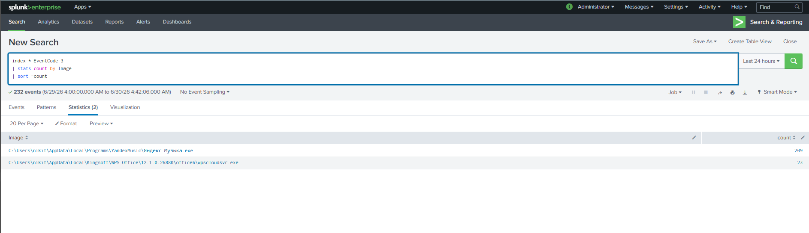

---

# Попытка обнаружения сканирования с Kali Linux

До установки Nmap на Windows была предпринята попытка зарегистрировать сетевую активность, выполняя сканирование с виртуальной машины Kali Linux.

Использовалась команда:

```bash
nmap -sS 192.168.0.10
```

где:

- **-sS** — TCP SYN Scan (полуоткрытое SYN-сканирование);
- **192.168.0.10** — IP-адрес исследуемого компьютера с Windows.

После завершения сканирования был выполнен поиск событий:

```spl
index=* EventCode=3
```

Ожидаемых событий, связанных со сканированием, обнаружено не было.

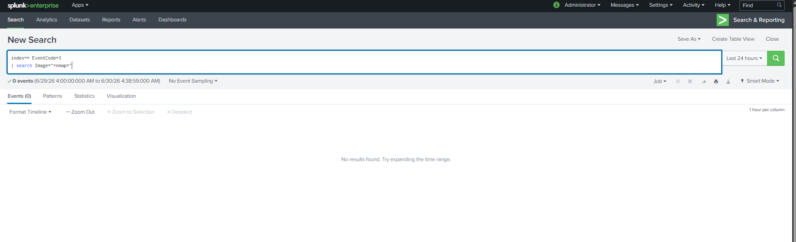

---

## Почему события не появились?

На первый взгляд может показаться, что Sysmon должен зарегистрировать входящее сетевое сканирование.

На практике это работает иначе.

Важно понимать принцип работы Event ID 3.

**Event ID 3 регистрирует только исходящие соединения, инициированные локальными процессами Windows.**

Во время эксперимента процесс **nmap** выполнялся на виртуальной машине Kali Linux.

С точки зрения Windows происходило следующее:

```text
Kali Linux (Nmap)
        │
        │ SYN
        ▼
Windows
```

Соединение инициировал внешний компьютер.

На стороне Windows не запускался процесс, устанавливающий исходящее соединение, поэтому Event ID 3 создан не был.

---

## Практический вывод

Данный эксперимент показал важную особенность Sysmon.

**Sysmon не является системой обнаружения сетевых атак (IDS).**

Он анализирует действия процессов, работающих локально на компьютере.

Поэтому:

- входящее сетевое сканирование не приводит к появлению Event ID 3;
- Event ID 3 появляется только тогда, когда соединение инициирует локальный процесс Windows.

Именно поэтому следующим этапом исследования стало выполнение Nmap непосредственно на Windows.

---

# Анализ запуска Nmap на Windows

После установки Nmap для Windows был выполнен локальный SYN-скан.

Использовалась команда:

```cmd
nmap -sS 127.0.0.1
```

Данная команда выполняет TCP SYN Scan локального компьютера.

Запуск утилиты был успешно зарегистрирован Sysmon как **Event ID 1 (Process Create)**.

Это подтвердило корректную регистрацию создания процесса.

Для поиска сетевых соединений процесса использовались запросы:

```spl
index=* EventCode=3 Image="*nmap.exe"
```

```spl
index=* EventCode=3
| search Image="*nmap*"
```

```spl
index=* Image="*nmap*"
```

Последний запрос подтвердил наличие большого количества событий **Event ID 1**, связанных с запуском **nmap.exe**.

Однако соответствующие события **Event ID 3** обнаружены не были.

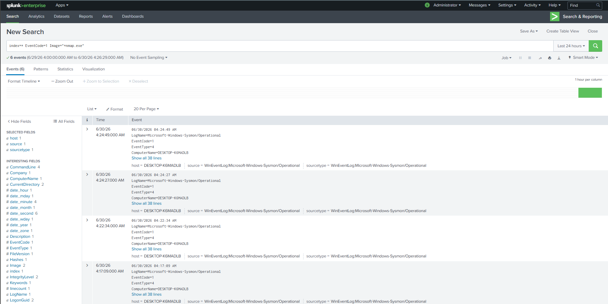

---

# Почему Event ID 3 отсутствует для Nmap?

Отсутствие Event ID 3 не означает отсутствие сетевой активности.

Sysmon работает на основе конфигурационного файла.

Именно конфигурация определяет:

- какие процессы журналировать;
- какие соединения записывать;
- какие события игнорировать.

Во время исследования было подтверждено, что:

- процесс **nmap.exe** успешно запускался;
- сетевое сканирование выполнялось;
- Event ID 1 был зарегистрирован;
- Event ID 3 для данного процесса отсутствовал.

Это свидетельствует о том, что используемая конфигурация Sysmon не регистрирует сетевые соединения процесса Nmap.

Подобная ситуация является нормальной и показывает, что качество расследования напрямую зависит от конфигурации источника логов.

---

# Итоги исследования Event ID 3

В ходе исследования были изучены возможности события **Network Connection (Event ID 3)**.

Удалось определить:

- какие процессы наиболее активно используют сеть;
- как строится базовая модель поведения системы (Baseline);
- каким образом анализируется сетевая активность процессов;
- почему входящее сканирование с Kali Linux не приводит к появлению Event ID 3;
- каким образом Sysmon связывает сетевые соединения с локальными процессами Windows;
- почему отсутствие события не всегда означает отсутствие сетевой активности.

Главный вывод данного этапа заключается в том, что **Sysmon регистрирует только те события, которые разрешены его конфигурацией**.

Поэтому при расследовании инцидентов аналитик должен учитывать не только сами журналы, но и особенности настройки источника логирования.

Совместный анализ **Event ID 1 (Process Create)** и **Event ID 3 (Network Connection)** позволяет значительно эффективнее восстанавливать последовательность действий процесса и понимать, какие программы взаимодействовали с сетью.

# Event ID 22 — DNS Query

## Что такое DNS?

**DNS (Domain Name System)** — это система доменных имен, которая преобразует привычные человеку доменные имена в IP-адреса.

Например:

```
github.com
        ↓
      DNS
        ↓
140.82.121.4
```

Любое обращение к сайту начинается с DNS-запроса. Компьютер не может подключиться к `github.com`, пока не узнает его IP-адрес.

---

## Что такое Event ID 22?

**Event ID 22 (DNS Query)** — это событие Sysmon, регистрирующее каждый DNS-запрос, выполненный процессом.

С помощью этого события можно определить:

- какой процесс выполнил DNS-запрос;
- какой домен был запрошен;
- какой IP-адрес вернул DNS-сервер;
- успешно ли был выполнен запрос;
- какой пользователь его инициировал.

Для аналитиков SOC это одно из самых полезных событий, поскольку практически любая вредоносная программа перед подключением к серверу злоумышленника сначала выполняет DNS-запрос.

---

# Основные поля Event ID 22

| Поле | Описание |
|------|----------|
| Image | Процесс, выполнивший DNS-запрос |
| QueryName | Имя запрашиваемого домена |
| QueryResults | IP-адрес, полученный в ответ |
| QueryStatus | Статус выполнения DNS-запроса |
| ProcessGuid | Уникальный идентификатор процесса |
| ProcessId | Идентификатор процесса |
| User | Пользователь, запустивший процесс |

---

# Генерация DNS-запросов

Для генерации событий Event ID 22 были использованы стандартные сетевые утилиты Windows.

В командной строке были выполнены команды:

```cmd
nslookup github.com
nslookup openai.com
ping github.com
ping openai.com
```

Команда `nslookup` выполняет DNS-запрос напрямую.

Команда `ping` сначала определяет IP-адрес домена через DNS, а затем пытается отправить ICMP-пакеты.

После выполнения команд в Splunk появились новые события Event ID 22.

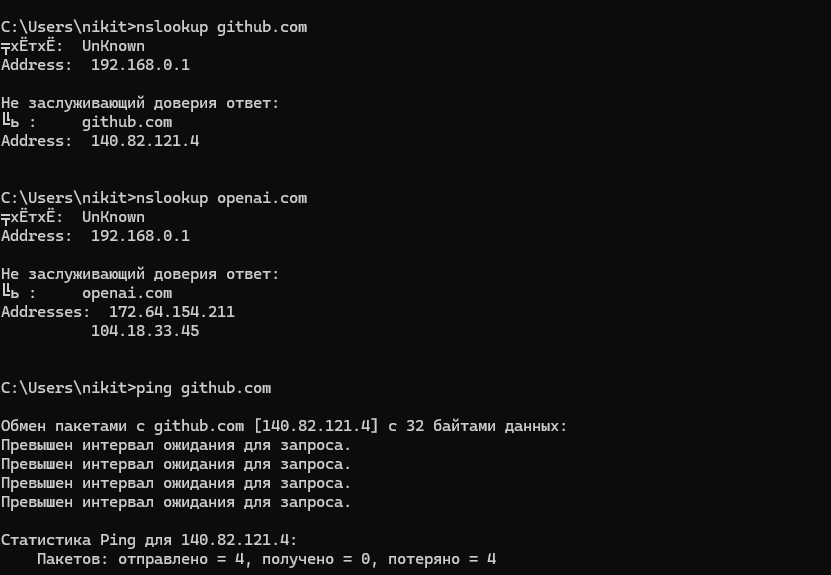

---

# Поиск DNS-событий

Для просмотра всех DNS-запросов использовался запрос:

```spl
index=* EventCode=22
```

В результате Splunk обнаружил более тысячи DNS-событий, что подтверждает корректную работу Event ID 22.

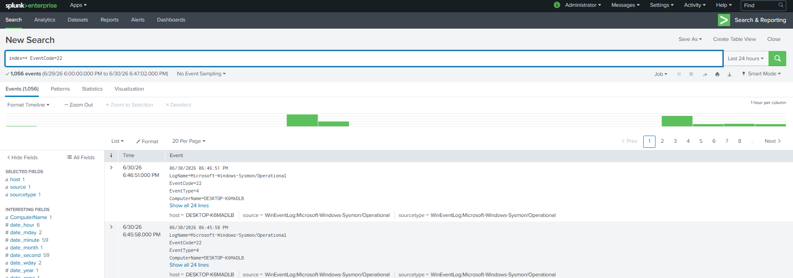

---

# Анализ наиболее популярных DNS-запросов

Для анализа наиболее часто запрашиваемых доменов использовался SPL-запрос:

```spl
index=* EventCode=22
| stats count by QueryName
| sort -count
```

Данный запрос группирует события по имени домена и показывает количество обращений к каждому из них.

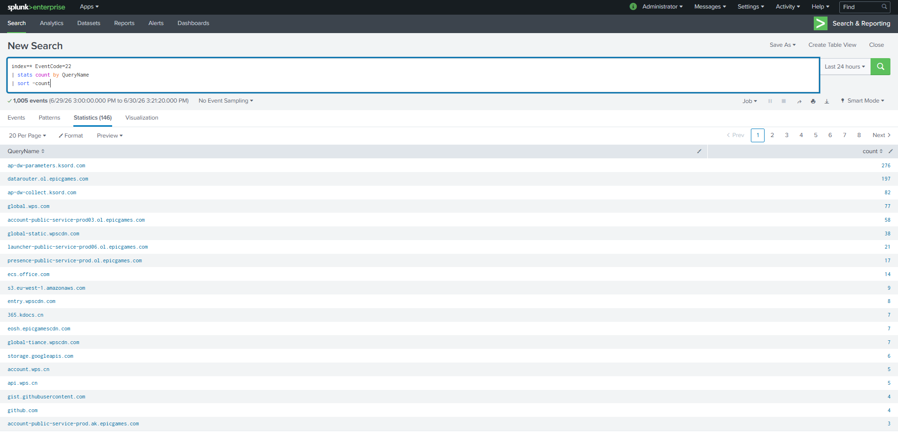

По результатам анализа были обнаружены обращения к:

- Epic Games;
- GitHub;
- WPS Office;
- Google APIs;
- Amazon AWS;
- другим установленным приложениям.

---

# Что такое DNS Baseline?

**DNS Baseline** — это нормальная (ожидаемая) картина DNS-запросов системы.

Перед поиском аномалий аналитик должен понимать, какие домены регулярно запрашиваются компьютером.

Обычно это:

- Microsoft;
- GitHub;
- Google;
- облачные сервисы;
- офисные приложения;
- игровые лаунчеры;
- браузеры.

Если впоследствии появится неизвестный домен, его будет значительно проще обнаружить на фоне уже известной активности.

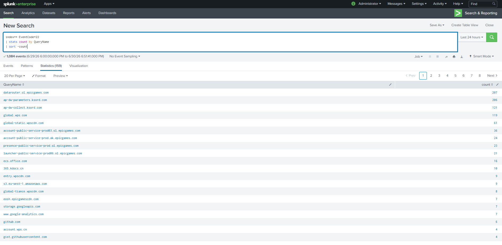

---

# Поиск конкретного DNS-запроса

После генерации активности был выполнен поиск запросов к GitHub.

Использовался следующий запрос:

```spl
index=* EventCode=22 QueryName="github.com"
```

Splunk успешно обнаружил несколько DNS-запросов к домену GitHub.

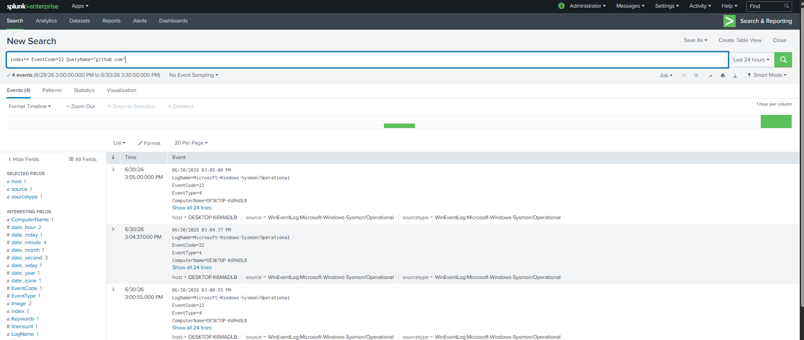

---

# Анализ события

После открытия события можно увидеть следующую информацию:

```
QueryName: github.com
QueryStatus: 0
QueryResults: ::ffff:140.82.121.4
Image: C:\Windows\System32\PING.EXE
User: DESKTOP-K6MADLB\cvvlone
```

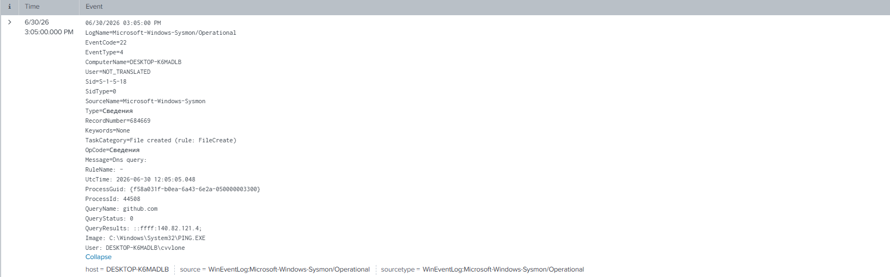

### Что означают эти поля?

**QueryName**

Доменное имя, которое было запрошено процессом.

---

**QueryStatus**

Статус выполнения DNS-запроса.

Значение:

```
0
```

означает успешное выполнение запроса.

---

**QueryResults**

IP-адрес, который DNS-сервер вернул в ответ.

В данном случае:

```
140.82.121.4
```

---

**Image**

Процесс, выполнивший DNS-запрос.

В нашем случае это:

```
PING.EXE
```

---

**User**

Пользователь, от имени которого выполнялся запрос.

---

# Корреляция событий через ProcessGuid

Одним из самых полезных полей Sysmon является **ProcessGuid**.

Это уникальный идентификатор процесса, который остается одинаковым во всех событиях, относящихся к одному запуску процесса.

Для восстановления полной цепочки событий был выполнен запрос:

```spl
index=* ProcessGuid="{PROCESS_GUID}"
| table _time EventCode Image QueryName DestinationIp DestinationPort ProcessGuid
| sort _time
```

В результате были обнаружены связанные события:

| EventCode | Событие |
|-----------|----------|
| 1 | Создание процесса PING.EXE |
| 22 | Выполнение DNS-запроса github.com |

Таким образом удалось восстановить последовательность действий одного процесса.

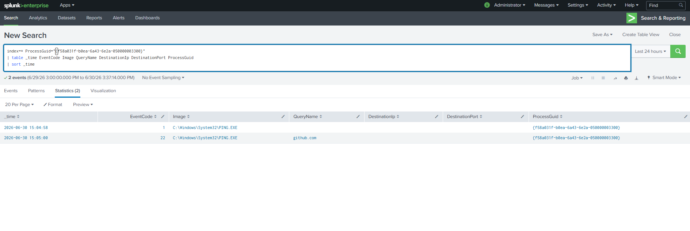

---

# Почему не появился Event ID 3?

Во время исследования возник вопрос, почему команда `ping` не создала событие Event ID 3.

Причина заключается в том, что Event ID 3 регистрирует **TCP** и **UDP** соединения.

Команда `ping` использует протокол **ICMP**, который Sysmon не регистрирует как Network Connection.

Поэтому для `ping` появляется Event ID 22 (DNS Query), но отсутствует Event ID 3.

---

# Проверка с использованием curl

Для проверки HTTPS-подключения была выполнена команда:

```cmd
curl https://github.com
```

Команда успешно получила HTML-код главной страницы GitHub.

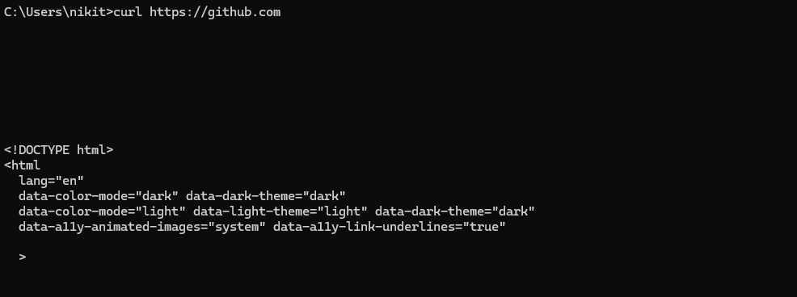

Однако при анализе событий было обнаружено, что DNS-запрос отображается следующим образом:

```
Image: <unknown process>
ProcessGuid: {00000000-0000-0000-0000-000000000000}
```

Это связано с тем, что часть DNS-запросов выполняется системной службой **Windows DNS Client**, поэтому Sysmon не всегда может сопоставить запрос с конкретным пользовательским процессом.

---

# Изменение конфигурации Sysmon

Во время исследования было принято решение создать собственную лабораторную конфигурацию Sysmon.

Причиной стало желание расширить логирование сетевой активности для инструментов, часто используемых администраторами и специалистами по информационной безопасности.

После создания новой конфигурации она была успешно загружена командой:

```powershell
Sysmon64.exe -c sysmonconfig-lab-fixed.xml
```

Проверка конфигурации показала:

```
Network connection: enabled
DNS lookup: enabled
```

Кроме того, в конфигурацию были добавлены дополнительные правила для следующих процессов:

- powershell.exe;
- cmd.exe;
- nslookup.exe;
- curl.exe;
- python.exe;
- nmap.exe;
- certutil.exe;
- bitsadmin.exe;
- mshta.exe;
- rundll32.exe.

---

# Проверка новой конфигурации

После загрузки новой конфигурации была повторно сгенерирована сетевая активность через PowerShell.

Поиск выполнялся запросом:

```spl
index=* EventCode=3 Image="*powershell.exe"
```

В результате Splunk успешно зарегистрировал события **Event ID 3**, что подтвердило корректную работу новой конфигурации Sysmon.

---

# Итоги

В ходе выполнения лабораторной работы были изучены возможности **Event ID 22 (DNS Query)**.

Удалось:

- изучить структуру DNS-событий Sysmon;
- научиться искать DNS-запросы в Splunk;
- проанализировать наиболее часто запрашиваемые домены;
- построить DNS Baseline системы;
- исследовать события конкретного домена (`github.com`);
- выполнить корреляцию событий по ProcessGuid;
- разобраться, почему `ping` создает Event ID 22, но не создает Event ID 3;
- исследовать особенности работы `curl`;
- изменить конфигурацию Sysmon и расширить возможности логирования;
- подтвердить работу новой конфигурации с помощью PowerShell.

Полученные знания позволяют использовать Event ID 22 для обнаружения подозрительных DNS-запросов, анализа поведения процессов и построения полной цепочки действий потенциального злоумышленника.
